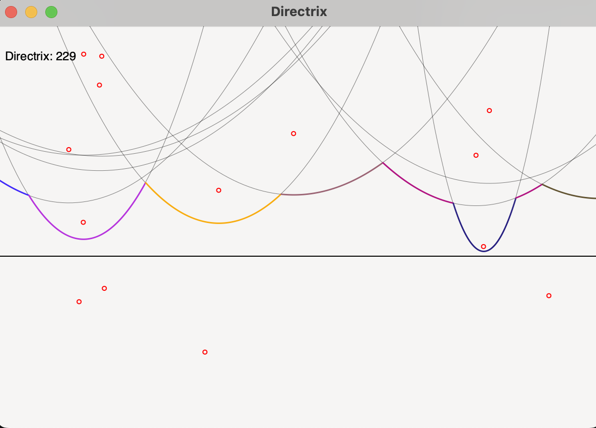
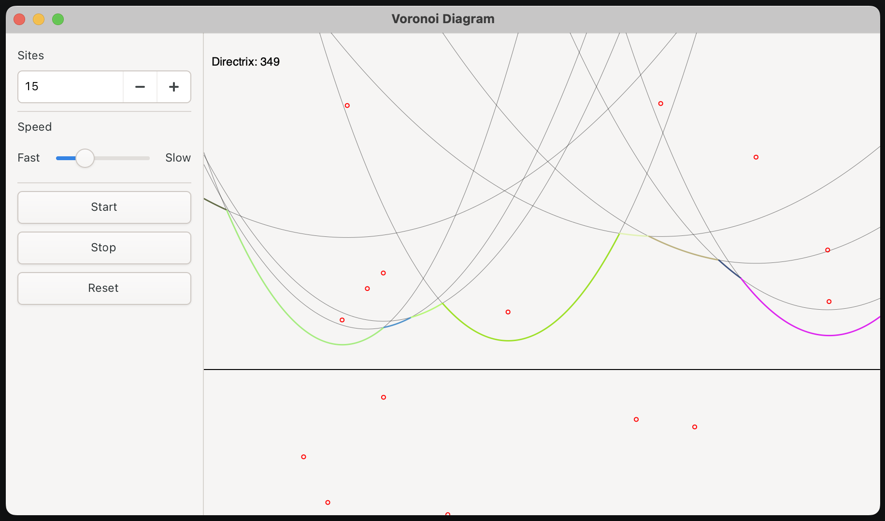

# voronoi

Voronoi diagram generation using Gtk 4 and Rust

## Step 1

The 1st step in building the beach line is calculating the active site. In this step we render the points on the active site to show the progress of the beach line as we move the directrix.

We do this by filtering the active sites to the sites "above" the directrix and then calculating the site with the max_y for the current X as we move X from left to right by X_STEP.

## Step 2

We add contols to the application for the number of sites, speed and controlling the sweep line progression. Fortune's algorithm is unidirectional so we need to manage the sweep line from top to bottom rather than allowing the mouse position to control the sweep line.

